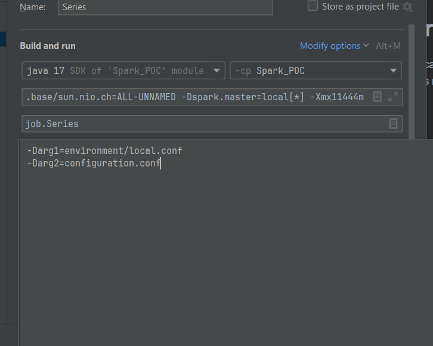

# Spark POC project

This project is created using Scala and Spark to read data from a PostgreSQL database, apply basic business rules for transformation, 
and then sink this data into Google Cloud Storage.

### Parameters 
 The abstract class **baseJob.scala** creates the sparkSession object with parameters 
 defined in configurations files as well as runtime parameters with the following structure
 **-DparamaterName=value**.

* Example

To create a sparkSession object, it is necessary to extend the
BaseJob class with an object that will serve as the main entry point of the application 
and override the executeJob method.

ELT Design
